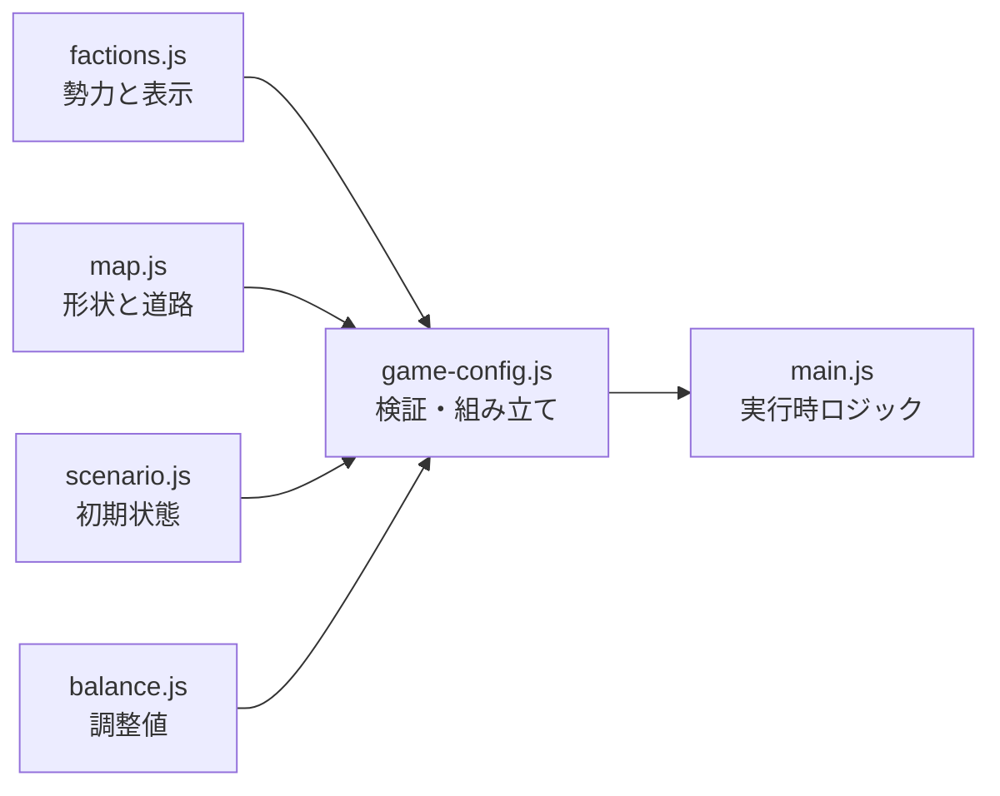

# 可変ゲーム設定ガイド

- 状態: 現行実装の設定索引
- 更新日: 2026-08-16
- 安定したゲームルール: [ゲーム設計仕様](../game-design.md)

このディレクトリは、プレイテストやマップ追加で変更されやすいデータを扱います。ルールの意味は `game-design.md`、現在使う具体的なデータは `src/config` を正とします。

## 設定の分割

| 変更したい内容 | 説明資料 | 正となるコード |
|---|---|---|
| 勢力名、画像、色、表示文言 | [勢力設定](./factions.md) | `src/config/factions.js` |
| マップ名、拠点形状、道路、表示装飾 | [マップ設定](./map.md) | `src/config/map.js` |
| プレイヤー／AI役、初期所有、初期部隊 | [シナリオ設定](./scenario.md) | `src/config/scenario.js` |
| 生産力、戦力、時間、AI、Gold、ショップ | [バランス設定](./balance.md) | `src/config/balance.js` |

`src/config/game-config.js` は4種類の設定を検証して組み立て、ゲーム本体へ読み取り専用の設定と新規作戦データを渡します。`src/main.js` へ個別マップの数値を追加しません。

## 変更時の基本手順

1. 変更の種類に対応する設定ファイルだけを編集する。
2. 拠点を追加・削除した場合は、マップ、初期所有、生産力、必要な初期部隊を合わせて更新する。
3. `node --test tests/config-validation.test.mjs` を実行する。
4. ローカルサーバーで新規作戦、移動、占領、勝敗、再開を確認する。
5. PWAのキャッシュ対象ファイルを追加した場合は `sw.js` も更新する。

設定検証は、重複ID、存在しない道路端点、不足した初期所有や生産力、到達不能な道路網、存在しない勢力や配置拠点などをエラーにします。

## 変更の分類

- 数値だけを調整する場合はADRを作らず、設定とこのディレクトリの資料を更新する。
- 「道路上だけ移動する」「守備隊を持たない」などルールを変える場合は `game-design.md` と該当ADRを更新する。
- 用語の意味を変える場合は `CONTEXT.md` を更新する。
- 静的PWAや戦闘方式など、覆すコストが高い判断を変更する場合は後続ADRを作る。
